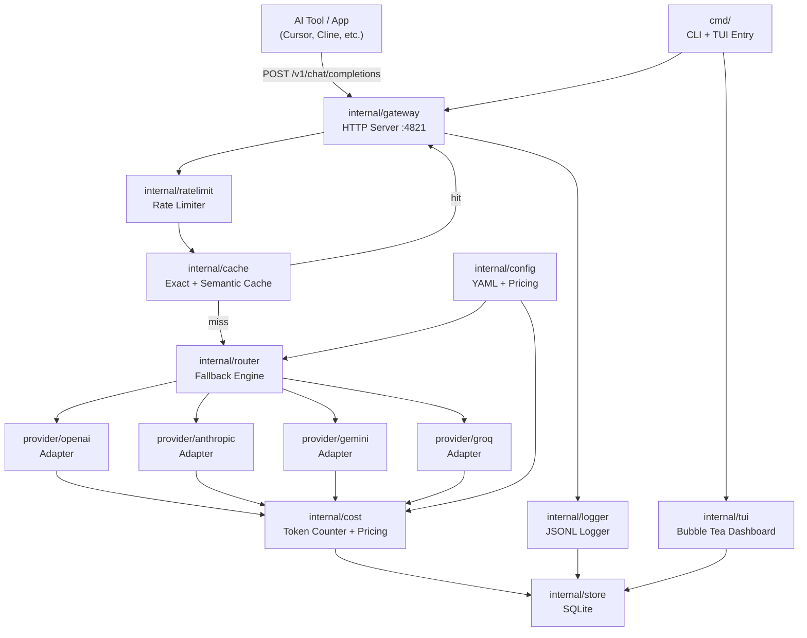
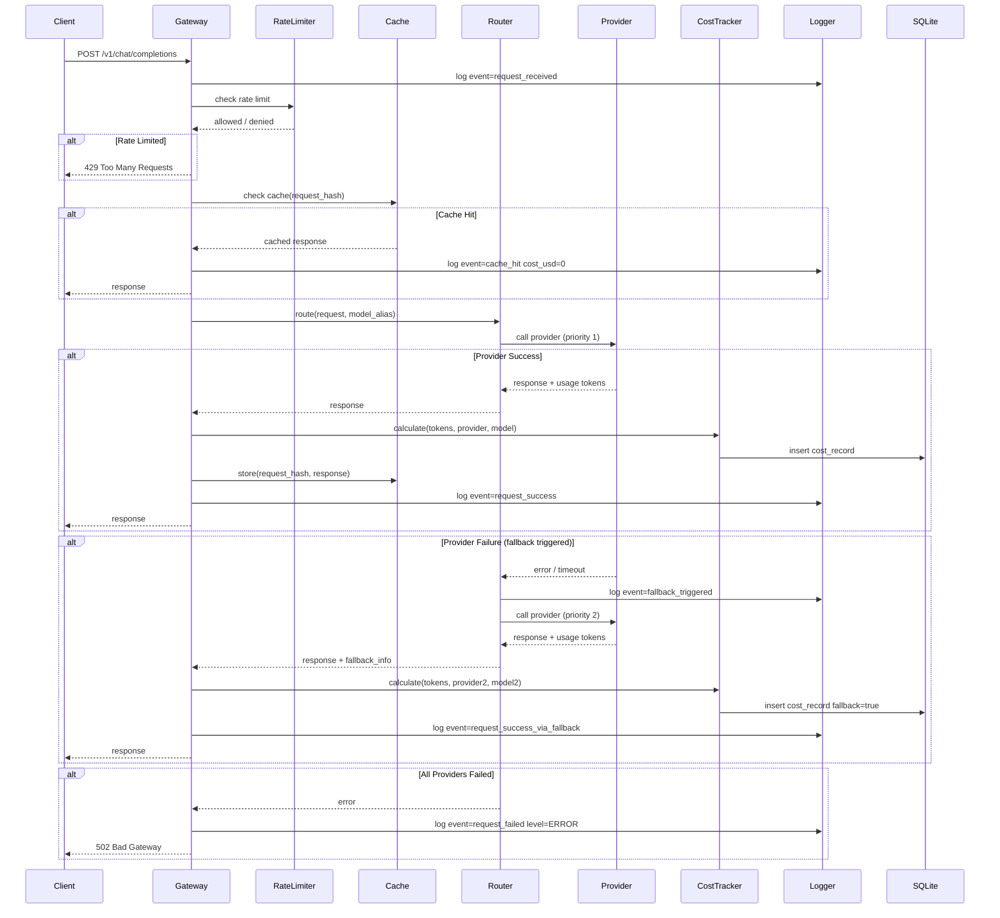

# ARCHITECTURE.md — TENDR
# Engineering Blueprint

Blueprint Version: 1.0.0
Project: TENDR — Tokenized Engine for Networked Distributed External Routing
Architecture Style: Modular Monolith, Single Binary
System Scope: Local AI Gateway Proxy

---

## 1. Context Lock

| Attribute | Value |
|---|---|
| Language | Go 1.22+ |
| Binary Target | Single binary, no runtime deps |
| CGO | PROHIBITED — pure Go only |
| Config Format | YAML |
| Primary Storage | SQLite (`modernc/sqlite` — no CGO) |
| Cache Storage | In-memory LRU + bbolt (disk, optional) |
| Log Format | JSONL via zerolog + lumberjack |
| TUI Framework | Bubble Tea + Lip Gloss |
| HTTP Router | chi |
| Config Library | viper |
| Build Tool | goreleaser |

### Allowed Libraries

| Library | Purpose |
|---|---|
| `github.com/go-chi/chi/v5` | HTTP routing |
| `github.com/spf13/viper` | Config management |
| `github.com/charmbracelet/bubbletea` | TUI framework |
| `github.com/charmbracelet/lipgloss` | TUI styling |
| `github.com/charmbracelet/bubbles` | TUI components |
| `github.com/rs/zerolog` | Structured JSONL logging |
| `gopkg.in/natefinish/lumberjack.v2` | Log rotation |
| `modernc.org/sqlite` | SQLite, no CGO |
| `go.etcd.io/bbolt` | Disk cache KV store |
| `github.com/google/uuid` | Request ID generation |

### Forbidden Libraries

| Library | Reason |
|---|---|
| Any CGO-dependent SQLite binding | Breaks cross-platform builds |
| `github.com/gin-gonic/gin` | Unnecessary, chi is sufficient |
| Any JavaScript/Node runtime | Binary must be pure Go |
| Any ORM (gorm, ent) | Direct SQL only — query clarity |
| `github.com/sirupsen/logrus` | Use zerolog — JSONL native |
| Any WebSocket library | Not needed in MVP |

### Dependency Direction

```
cmd → internal/gateway
         → internal/router
         → internal/provider
         → internal/cache
         → internal/cost
         → internal/ratelimit
         → internal/logger
         → internal/config
         → internal/tui
         → internal/store
```

Higher layers MUST NOT import lower layers' internals.
`internal/store` MUST NOT import any other internal package.
`internal/config` MUST NOT import any other internal package.
`internal/logger` MUST NOT import any other internal package.

---

## 2. Architectural Boundaries

### Layers

| Layer | Package | Responsibility |
|---|---|---|
| Entry | `cmd/` | CLI parsing, TUI launch, process lifecycle |
| Gateway | `internal/gateway` | HTTP server, request lifecycle orchestration |
| Router | `internal/router` | Fallback logic, provider selection, mode execution |
| Provider | `internal/provider` | Per-provider adapters, request normalization |
| Cache | `internal/cache` | Exact + semantic cache, hit/miss logic |
| Cost | `internal/cost` | Token counting, pricing lookup, cost recording |
| Rate Limit | `internal/ratelimit` | Per-key and per-provider rate limiting |
| Store | `internal/store` | SQLite access, migrations, query methods |
| Logger | `internal/logger` | JSONL logger init, log entry construction |
| Config | `internal/config` | YAML parsing, validation, pricing fetch |
| TUI | `internal/tui` | Bubble Tea models, views, update handlers |

### Allowed Call Flow

```
cmd → gateway → router → provider
             → cache
             → cost → store
             → ratelimit
             → logger
```

### Forbidden Call Flow

- `provider` MUST NOT call `router`
- `store` MUST NOT call any other internal package
- `cache` MUST NOT call `cost`
- `tui` MUST NOT call `gateway` directly — reads from `store` and `logger` only
- `config` MUST NOT call `store`

---

## 3. System Architecture Diagram



---

## 4. Request Lifecycle — End to End



---

## 5. Data Model Contract

### Normalization Level: 3NF

### Tables

#### `requests`
Stores every proxied request.

```sql
CREATE TABLE requests (
    id            TEXT PRIMARY KEY,        -- uuid v4
    ts            DATETIME NOT NULL,       -- RFC3339
    model_alias   TEXT NOT NULL,
    provider      TEXT NOT NULL,
    model         TEXT NOT NULL,
    fallback_used INTEGER NOT NULL DEFAULT 0,
    fallback_from TEXT,
    cache_hit     INTEGER NOT NULL DEFAULT 0,
    routing_mode  TEXT NOT NULL,           -- reliable | fast | smart
    status        TEXT NOT NULL,           -- success | failed | fallback
    latency_ms    INTEGER NOT NULL,
    input_tokens  INTEGER NOT NULL DEFAULT 0,
    output_tokens INTEGER NOT NULL DEFAULT 0,
    cost_usd      REAL NOT NULL DEFAULT 0,
    pricing_source TEXT NOT NULL,          -- hardcoded | fetched | override
    request_id    TEXT NOT NULL
);

CREATE INDEX idx_requests_ts ON requests(ts);
CREATE INDEX idx_requests_provider ON requests(provider);
CREATE INDEX idx_requests_model_alias ON requests(model_alias);
```

#### `cache_entries`
Tracks cache entries for TUI visibility.

```sql
CREATE TABLE cache_entries (
    id           TEXT PRIMARY KEY,
    request_hash TEXT NOT NULL UNIQUE,
    model_alias  TEXT NOT NULL,
    created_at   DATETIME NOT NULL,
    expires_at   DATETIME,
    hit_count    INTEGER NOT NULL DEFAULT 0,
    last_hit_at  DATETIME,
    cache_type   TEXT NOT NULL             -- exact | semantic
);

CREATE INDEX idx_cache_entries_hash ON cache_entries(request_hash);
CREATE INDEX idx_cache_entries_expires ON cache_entries(expires_at);
```

#### `pricing_snapshots`
Records pricing table in use at any point in time.

```sql
CREATE TABLE pricing_snapshots (
    id         TEXT PRIMARY KEY,
    fetched_at DATETIME NOT NULL,
    source     TEXT NOT NULL,              -- hardcoded | fetched | override
    payload    TEXT NOT NULL               -- JSON blob of full pricing table
);
```

### Index Policy
- REQUIRED on all columns used in WHERE clauses
- REQUIRED on all timestamp columns used for range queries
- PROHIBITED on columns never queried directly

### Constraint Policy
- All PRIMARY KEY: TEXT (uuid)
- All timestamps: DATETIME stored as RFC3339 TEXT
- REAL for monetary values (usd)
- INTEGER for booleans (0/1)
- NOT NULL on all columns unless nullable is semantically required

---

## 6. Provider Adapter Contract

Each provider MUST implement this Go interface:

```go
type Provider interface {
    Name() string
    Complete(ctx context.Context, req *CompletionRequest) (*CompletionResponse, error)
    EstimateTokens(req *CompletionRequest) int
}

type CompletionRequest struct {
    Model    string
    Messages []Message
    Stream   bool
    Extra    map[string]any
}

type CompletionResponse struct {
    ID           string
    Content      string
    InputTokens  int
    OutputTokens int
    Provider     string
    Model        string
    Latency      time.Duration
}
```

Provider adapters MUST:
- Normalize input from OpenAI schema to provider-native schema
- Normalize output from provider-native schema to OpenAI schema
- Return typed errors: `ErrRateLimit`, `ErrTimeout`, `ErrProviderDown`, `ErrInvalidKey`
- NEVER return raw provider error strings directly to client

---

## 7. Fallback Engine Contract

### Mode Definitions

| Mode | Trigger Condition |
|---|---|
| `reliable` | `ErrRateLimit` OR `ErrTimeout` OR `ErrProviderDown` OR HTTP 5xx |
| `fast` | Response latency > `latency_threshold_ms` |
| `smart` | Any condition from `reliable` OR `fast` |

### Execution Policy

```
MUST try providers in priority order (ascending integer)
MUST NOT skip priorities
MUST record fallback_from on fallback
MUST NOT retry same provider more than once per request
MUST return error if all providers exhausted
MAX providers per alias: 5
```

### Timeout Policy

```
Provider timeout: configured per-provider in YAML
Default timeout: 30000ms
Minimum allowed timeout: 1000ms
Maximum allowed timeout: 120000ms
```

---

## 8. Cost Tracking Contract

### Pricing Resolution Order

```
1. Check YAML override for provider + model → use if present
2. Check in-memory fetched pricing (loaded at startup) → use if present
3. Fall back to hardcoded default → always present
```

### Cost Calculation

```
input_cost  = (input_tokens  / 1_000_000) * pricing.input_per_1m
output_cost = (output_tokens / 1_000_000) * pricing.output_per_1m
total_cost  = input_cost + output_cost
```

### Pricing Fetch Policy

```
MUST fetch on startup if fetch_on_startup: true
MUST cache fetched pricing in memory for session lifetime
MUST fall back to hardcoded if fetch fails
MUST log fetch result: success / failed / fallback
MUST record pricing_source on every cost entry
Fetch timeout: 5000ms MAX
MUST NOT block gateway startup if fetch fails
```

---

## 9. Logging Contract

### JSONL Schema (every log entry)

```json
{
  "ts": "2026-05-30T11:00:00Z",
  "level": "INFO",
  "component": "gateway",
  "event": "request_received",
  "request_id": "req_abc123",
  "user_id": "anonymous",
  "metadata": {
    "model_alias": "coding",
    "provider": "openai",
    "model": "gpt-4o"
  }
}
```

### Level Policy

| Level | Usage |
|---|---|
| `DEBUG` | Internal state, only when log_level=debug |
| `INFO` | Normal operation events |
| `WARN` | Degraded operation, fallback triggered |
| `ERROR` | Request failed, provider down, parse error |
| `FATAL` | Process cannot continue |

### Required Events

| Event | Level | Component |
|---|---|---|
| `gateway_started` | INFO | gateway |
| `request_received` | INFO | gateway |
| `cache_hit` | INFO | cache |
| `cache_miss` | INFO | cache |
| `provider_selected` | INFO | router |
| `fallback_triggered` | WARN | router |
| `provider_error` | ERROR | provider |
| `request_success` | INFO | gateway |
| `request_failed` | ERROR | gateway |
| `pricing_fetched` | INFO | cost |
| `pricing_fetch_failed` | WARN | cost |
| `rate_limit_hit` | WARN | ratelimit |
| `config_loaded` | INFO | config |
| `config_error` | ERROR | config |

### Log Rotation Policy

```
max_size_mb: 50        (per file)
max_backups: 5         (retained rotated files)
compress: true         (gzip rotated files)
```

---

## 10. Cache Contract

### Exact Cache

```
Key: SHA256(canonical_json(request_body))
Value: CompletionResponse JSON
Store: in-memory LRU (default) | bbolt (if disk persistence enabled)
TTL: configured per model alias (default: no TTL)
Eviction: LRU when max_entries exceeded
Max entries default: 1000
```

### Semantic Cache

```
Status: OPTIONAL — only if semantic_cache.enabled: true in config
Requires: embedding provider configured
Key: embedding vector of request content
Similarity threshold: configurable (default: 0.95)
Store: in-memory only (MVP)
```

### Cache Invalidation Policy

```
MUST expose: tendr cache clear (all)
MUST expose: tendr cache clear --alias <name>
MUST NOT auto-invalidate except on TTL expiry
MUST NOT invalidate on provider change
```

---

## 11. Rate Limit Contract

```
Algorithm: Token bucket
Storage: in-memory only (no Redis, no external dep)
Scope: per model_alias per minute (global)
       per provider per minute (provider protection)
Config: rate_limits section in YAML
Default global: 60 req/min
Default per-provider: unlimited unless configured
Exceeded response: HTTP 429, body: {"error": "rate_limit_exceeded", "retry_after_ms": N}
```

---

## 12. Project Structure

```
tendr/
├── cmd/
│   └── tendr/
│       └── main.go              # entry point, CLI parsing
├── internal/
│   ├── config/
│   │   ├── config.go            # YAML parsing, struct definitions
│   │   ├── validate.go          # config validation rules
│   │   └── pricing.go           # pricing fetch + resolution
│   ├── gateway/
│   │   ├── server.go            # HTTP server, middleware chain
│   │   ├── handler.go           # /v1/chat/completions handler
│   │   └── middleware.go        # logging, request ID injection
│   ├── router/
│   │   ├── router.go            # provider selection logic
│   │   ├── fallback.go          # fallback mode implementations
│   │   └── modes.go             # reliable | fast | smart
│   ├── provider/
│   │   ├── provider.go          # Provider interface
│   │   ├── openai/
│   │   │   └── adapter.go
│   │   ├── anthropic/
│   │   │   └── adapter.go
│   │   ├── gemini/
│   │   │   └── adapter.go
│   │   └── groq/
│   │       └── adapter.go
│   ├── cache/
│   │   ├── cache.go             # Cache interface
│   │   ├── exact.go             # exact cache implementation
│   │   ├── semantic.go          # semantic cache implementation
│   │   └── disk.go              # bbolt persistence
│   ├── cost/
│   │   ├── tracker.go           # cost calculation + recording
│   │   └── pricing.go           # pricing table management
│   ├── ratelimit/
│   │   └── limiter.go           # token bucket implementation
│   ├── store/
│   │   ├── store.go             # SQLite connection + migrations
│   │   ├── requests.go          # request query methods
│   │   ├── cache.go             # cache entry query methods
│   │   └── migrations/
│   │       └── 001_init.sql
│   ├── logger/
│   │   └── logger.go            # zerolog init, entry builders
│   └── tui/
│       ├── tui.go               # Bubble Tea root model
│       ├── tabs/
│       │   ├── dashboard.go
│       │   ├── cost.go
│       │   ├── cache.go
│       │   ├── config.go
│       │   └── logs.go
│       └── styles/
│           └── styles.go        # Lip Gloss definitions
├── pricing.json                 # default bundled pricing table
├── config.example.yaml
├── .goreleaser.yaml
├── Makefile
├── go.mod
├── go.sum
├── PARKING_LOT.md
└── docs/
    ├── PRD.md
    ├── ARCHITECTURE.md
    ├── DESIGN.md
    ├── PLAN.md
    └── AGENTS.md
```

---

## 13. Component Responsibility Matrix

| Component | Responsibility | Scenario Supported |
|---|---|---|
| `cmd/tendr` | Parse CLI flags, launch gateway or TUI | All entry points |
| `internal/gateway` | HTTP server lifecycle, request orchestration | All requests |
| `internal/router` | Provider selection, fallback execution | Routing + fallback |
| `internal/provider/*` | Normalize requests per provider API | Multi-provider support |
| `internal/cache` | Serve cached responses, store new responses | Cost reduction |
| `internal/cost` | Calculate and record per-request cost | Cost tracking |
| `internal/ratelimit` | Enforce request rate limits | Abuse prevention |
| `internal/store` | Persist cost records, cache metadata | TUI queries, audit |
| `internal/logger` | Emit structured JSONL log entries | Observability |
| `internal/config` | Parse YAML, validate, resolve pricing | Configuration |
| `internal/tui` | Render interactive dashboard | Monitoring + ops |

---

## 14. Verification Rules

### Acceptance Scenarios

| Scenario | Expected Outcome |
|---|---|
| Valid request to known model alias | Response returned, cost recorded, log emitted |
| Primary provider returns 429 | Fallback triggered, secondary provider used |
| Primary provider exceeds latency threshold (fast mode) | Fallback triggered |
| Exact cache hit | Cached response returned, cost $0.00 |
| All providers fail | HTTP 502 returned, error logged |
| Rate limit exceeded | HTTP 429 returned, retry_after_ms in body |
| Config YAML parse error | Error logged with line reference, process exits |
| Pricing fetch fails on startup | Hardcoded pricing used, WARN logged |
| Unknown model alias in request | HTTP 400 returned |

### Failure Scenarios

| Failure | Expected Behavior |
|---|---|
| SQLite write fails | Log ERROR, continue serving (cost record dropped) |
| Cache write fails | Log WARN, continue serving (cache miss next time) |
| Pricing fetch timeout | Use hardcoded pricing, WARN logged |
| Provider returns malformed response | Log ERROR, attempt fallback if available |
| Config file not found | Exit with clear error message and path hint |

### Non-Goals

- TENDR does NOT modify request content (no prompt injection)
- TENDR does NOT store raw request/response bodies in SQLite
- TENDR does NOT authenticate clients in MVP
- TENDR does NOT support multi-user isolation in MVP
- TENDR does NOT expose Prometheus metrics in MVP