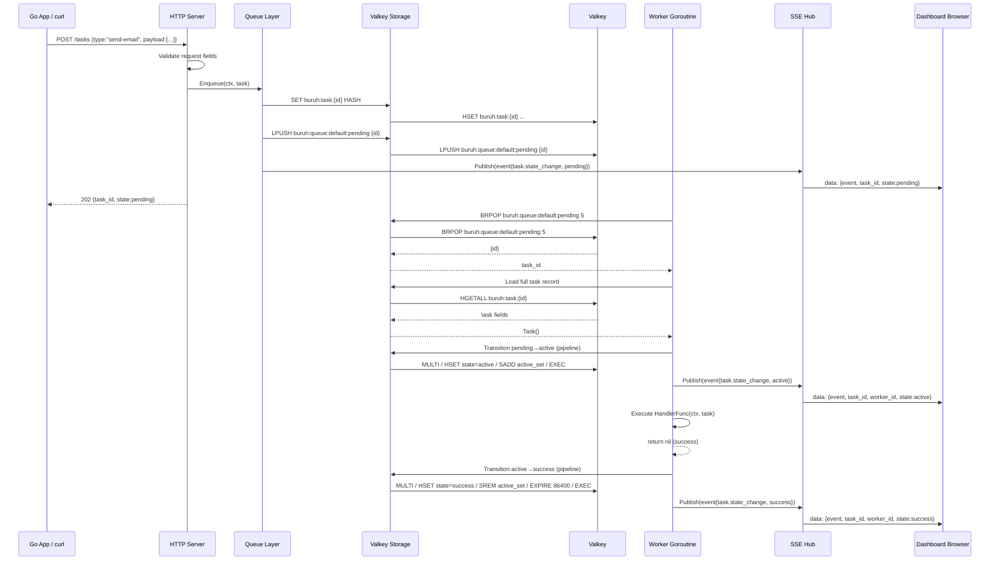
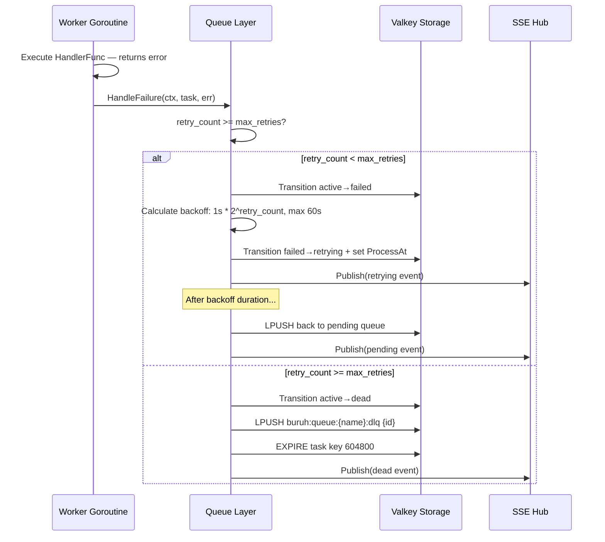

# ARCHITECTURE.md — buruh
# Machine-Consumable Engineering Specification (MCES)

Blueprint Version: 1.0.0
Project Name: buruh
Architecture Style: Monolith — single binary, layered architecture
System Scope: Task queue engine + SSE dashboard server
Language: Go 1.22+

---

## 1. Context Lock

### Runtime

| Property        | Value                          |
|-----------------|--------------------------------|
| Language        | Go 1.22+                       |
| Build target    | Single static binary           |
| OS target       | Linux, macOS, Windows (amd64, arm64) |
| AVX requirement | NONE — PROHIBITED              |
| CGO             | DISABLED — `CGO_ENABLED=0`     |

### Storage

| Property        | Value                          |
|-----------------|--------------------------------|
| Broker          | Valkey 8.x                     |
| Protocol        | Redis-compatible TCP           |
| Client library  | `github.com/valkey-io/valkey-go` |
| Persistence     | Valkey RDB (default config)    |

### Allowed Libraries (EXACT)

```
github.com/valkey-io/valkey-go     — Valkey client
github.com/stretchr/testify        — test assertions only
gopkg.in/yaml.v3                   — config file parsing
```

### Forbidden Libraries

```
github.com/gin-gonic/gin           — NOT_ALLOWED: stdlib net/http is sufficient
github.com/labstack/echo           — NOT_ALLOWED: stdlib net/http is sufficient
github.com/go-chi/chi              — NOT_ALLOWED: stdlib net/http is sufficient
github.com/uber-go/zap             — NOT_ALLOWED: stdlib log/slog is sufficient
github.com/rs/zerolog              — NOT_ALLOWED: stdlib log/slog is sufficient
github.com/hibiken/asynq           — NOT_ALLOWED: this IS the competing library
any package requiring CGO          — PROHIBITED
any package with AVX instructions  — PROHIBITED
```

### Dependency Direction (STRICT)

```
cmd → engine → queue → storage
cmd → server → engine
server → sse
dashboard (static files) → server (served as embed)
```

RULE: Lower layers MUST NOT import upper layers.
RULE: `storage` package MUST NOT import `queue` or `engine`.
RULE: `queue` package MUST NOT import `server` or `sse`.

---

## 2. Architectural Boundaries

### Layer Definitions

```
┌─────────────────────────────────────────┐
│  cmd/                                   │  Entry point. Wires dependencies.
│  └── buruh/main.go                      │  MUST contain zero business logic.
├─────────────────────────────────────────┤
│  internal/server/                       │  HTTP server. Routes. SSE hub.
│                                         │  MUST NOT contain queue logic.
├─────────────────────────────────────────┤
│  internal/engine/                       │  Worker pool lifecycle.
│                                         │  Starts/stops workers.
│                                         │  Owns handler registry.
├─────────────────────────────────────────┤
│  internal/queue/                        │  Task state machine.
│                                         │  Enqueue, dequeue, state transitions.
│                                         │  Retry logic. DLQ logic.
├─────────────────────────────────────────┤
│  internal/storage/                      │  Valkey operations.
│                                         │  All Valkey calls live here.
│                                         │  Returns domain types, not Valkey types.
├─────────────────────────────────────────┤
│  internal/sse/                          │  SSE hub. Client registry. Broadcaster.
│                                         │  MUST NOT know about task domain.
│                                         │  Operates on raw event messages only.
├─────────────────────────────────────────┤
│  internal/config/                       │  Config loading. Validation.
│                                         │  MUST be imported by cmd only.
├─────────────────────────────────────────┤
│  dashboard/                             │  Static HTML/CSS/JS.
│                                         │  Embedded via go:embed.
│                                         │  MUST NOT be a Go package.
└─────────────────────────────────────────┘
```

### Allowed Call Flow

```
cmd        → config, engine, server
server     → engine, sse, queue
engine     → queue, sse
queue      → storage, sse
storage    → valkey client only
sse        → (no domain dependencies)
```

### Forbidden Call Flow

```
storage    → queue              PROHIBITED
storage    → engine             PROHIBITED
queue      → server             PROHIBITED
queue      → engine             PROHIBITED
sse        → queue              PROHIBITED
sse        → storage            PROHIBITED
engine     → server             PROHIBITED
```

### Cross-Layer Rules

- RULE: Interfaces MUST be defined in the consuming package, not the providing package.
- RULE: Each package MUST expose a minimal public surface area.
- RULE: All inter-package communication via interfaces — never concrete types across boundaries.
- RULE: `context.Context` MUST be the first argument of every public function that performs I/O.

---

## 3. Data Model Contract

### Normalization

All task data stored in Valkey as JSON-encoded hash fields.
No relational DB. No joins. Denormalization is acceptable and expected.

### Task Record

```json
{
  "id":          "string — UUID v4",
  "type":        "string — handler name, e.g. send-email",
  "queue":       "string — queue name, e.g. default",
  "payload":     "string — JSON-encoded, max 1MB",
  "state":       "string — enum: pending|active|success|failed|retrying|dead",
  "retry_count": "int — current retry attempt number, starts at 0",
  "max_retries": "int — maximum allowed retries before DLQ",
  "error":       "string — last error message, empty if none",
  "worker_id":   "string — worker that last processed this task, empty if pending",
  "created_at":  "int64 — Unix timestamp milliseconds",
  "updated_at":  "int64 — Unix timestamp milliseconds",
  "process_at":  "int64 — Unix timestamp milliseconds — when to process (for delayed tasks)"
}
```

### Valkey Key Schema

```
buruh:task:{id}              HASH  — full task record
buruh:queue:{name}:pending   LIST  — pending task IDs (LPUSH enqueue, BRPOP dequeue)
buruh:queue:{name}:active    SET   — task IDs currently being processed
buruh:queue:{name}:dlq       LIST  — dead letter task IDs
buruh:worker:{id}:state      STRING — worker state: idle|active
buruh:meta:queues            SET   — all known queue names
```

### Key Constraints

- `buruh:task:{id}` TTL: REQUIRED — set to 86400 seconds (24h) on success state
- `buruh:task:{id}` TTL on dead state: REQUIRED — set to 604800 seconds (7 days)
- `buruh:task:{id}` TTL on pending/active/retrying: NONE — no expiry while in-flight
- MAX payload size: 1MB — enforced at enqueue time, return error if exceeded
- Task ID: UUID v4 — generated by engine, NOT by client

### SSE Event Schema

```json
{
  "event":      "string — task.state_change | worker.state_change | queue.stats",
  "task_id":    "string — UUID, empty for worker events",
  "worker_id":  "string — worker identifier",
  "queue":      "string — queue name",
  "from_state": "string — previous state",
  "to_state":   "string — new state",
  "timestamp":  "int64 — Unix timestamp milliseconds",
  "meta":       "object — optional additional data"
}
```

### HTTP API Contracts

**POST /tasks — Enqueue**

Request:
```json
{
  "type":        "string REQUIRED",
  "queue":       "string OPTIONAL default=default",
  "payload":     "object OPTIONAL",
  "max_retries": "int OPTIONAL default=3",
  "delay_ms":    "int OPTIONAL default=0"
}
```

Response 202:
```json
{
  "task_id": "string",
  "queue":   "string",
  "state":   "pending"
}
```

Response 400:
```json
{
  "error": "string — validation message"
}
```

**GET /tasks/{id}**

Response 200:
```json
{
  "id":          "string",
  "type":        "string",
  "queue":       "string",
  "state":       "string",
  "retry_count": "int",
  "max_retries": "int",
  "error":       "string",
  "worker_id":   "string",
  "created_at":  "int64",
  "updated_at":  "int64"
}
```

Response 404:
```json
{
  "error": "task not found"
}
```

**GET /queues**

Response 200:
```json
{
  "queues": [
    {
      "name":    "string",
      "pending": "int",
      "active":  "int",
      "dlq":     "int"
    }
  ]
}
```

**GET /metrics**

Response 200 (plain text, not JSON):
```
buruh_tasks_total{state="success"} 1234
buruh_tasks_total{state="failed"} 12
buruh_tasks_total{state="dead"} 3
buruh_workers_total 10
buruh_workers_active 4
buruh_queue_depth{queue="default"} 42
buruh_queue_depth{queue="email"} 7
```

**GET /health**

Response 200:
```json
{
  "status":  "ok",
  "storage": "ok|error",
  "workers": "int — active worker count"
}
```

**GET /stream — SSE**

Response headers:
```
Content-Type: text/event-stream
Cache-Control: no-cache
Connection: keep-alive
X-Accel-Buffering: no
```

Event format:
```
data: {"event":"task.state_change",...}\n\n
```

Heartbeat: send `data: {"event":"heartbeat"}\n\n` every 15 seconds.

**GET / — Dashboard**

Response: serves embedded `dashboard/index.html`
Content-Type: text/html

---

## 4. Execution Constraints

### Async Policy

- RULE: Worker goroutines MUST use `context.Context` for cancellation.
- RULE: Engine shutdown MUST wait for in-flight tasks to complete — max wait 30 seconds.
- RULE: After 30 seconds, in-flight tasks MUST be re-queued as pending before shutdown.
- RULE: Worker pool MUST use `sync.WaitGroup` for graceful shutdown tracking.
- RULE: Valkey BRPOP timeout: 5 seconds — workers re-check context on each iteration.
- RULE: All goroutines MUST have a named recover() for panic handling.

### Transaction Policy

- RULE: Valkey operations that modify multiple keys MUST use MULTI/EXEC pipeline.
- RULE: State transition (e.g. pending → active) MUST be atomic: remove from pending list + set state hash in one pipeline.
- RULE: No distributed transactions across multiple Valkey connections.

### Logging Policy

- RULE: Use `log/slog` (stdlib) — structured logging.
- RULE: Log level configurable via config file: debug | info | warn | error.
- RULE: Default log level: info.
- RULE: Every state transition MUST emit an info log entry.
- RULE: Every error MUST emit an error log entry with task ID and worker ID.
- RULE: Log format: JSON in production, text in development.

Log entry fields (REQUIRED on every log):
```
time      string   ISO8601
level     string   debug|info|warn|error
msg       string   human-readable message
task_id   string   empty string if not task-related
worker_id string   empty string if not worker-related
queue     string   empty string if not queue-related
```

### Error Handling Policy

- RULE: Errors MUST be wrapped with context: `fmt.Errorf("queue.Enqueue: %w", err)`
- RULE: PROHIBITED: silent error discard (`_ = someFunc()`)
- RULE: Handler errors MUST be returned as `error` — panic is caught by recover()
- RULE: Storage errors MUST be propagated up — engine decides retry behavior, not storage layer
- RULE: HTTP handlers MUST return structured JSON error responses — never plain text errors

### Validation Policy

- RULE: Validate at API boundary (server layer) — not in queue or storage layer
- RULE: Task type: REQUIRED, non-empty string, max 128 chars
- RULE: Queue name: REQUIRED, alphanumeric + hyphen only, max 64 chars, regex `^[a-z0-9-]+$`
- RULE: Payload: OPTIONAL, valid JSON if present, max 1MB
- RULE: max_retries: OPTIONAL, int 0–10, default 3
- RULE: delay_ms: OPTIONAL, int 0–3600000 (max 1 hour), default 0

---

## 5. Integration Contracts

### Module Rules

- RULE: Module path: `github.com/{username}/buruh`
- RULE: Go version in go.mod: EXACT `go 1.22`
- RULE: `go mod tidy` MUST pass with zero diff before any commit
- RULE: No `replace` directives in go.mod

### File Rules

- RULE: One package per directory
- RULE: Test files: `{filename}_test.go` in same package (white-box) or `{package}_test` (black-box)
- RULE: `dashboard/` directory MUST contain only static assets: `.html`, `.css`, `.js`
- RULE: Dashboard assets MUST be embedded via `//go:embed dashboard` in `internal/server/server.go`
- RULE: Config file: `buruh.yaml` — loaded from working directory or path specified by `--config` flag
- RULE: No `.env` file support — environment variables only for deployment overrides

### Configuration Schema

```yaml
server:
  host: "0.0.0.0"       # string, default 0.0.0.0
  port: 8080             # int, default 8080

valkey:
  addr: "localhost:6379" # string, REQUIRED
  password: ""           # string, optional
  db: 0                  # int, default 0

engine:
  workers: 10            # int, 1-50, default 10
  queues:                # list of queue names to consume
    - default
  shutdown_timeout: 30   # seconds, default 30

log:
  level: "info"          # debug|info|warn|error
  format: "json"         # json|text
```

### Security Rules

- RULE: No authentication in v1 — document this explicitly in README
- RULE: Dashboard MUST be served only on configured host:port — no wildcard binding unless configured
- RULE: Payload data MUST NOT be logged at info level — only at debug level
- RULE: Task IDs MUST be UUID v4 — sequential IDs are PROHIBITED (enumeration risk)
- RULE: HTTP response MUST include header: `X-Content-Type-Options: nosniff`
- RULE: SSE endpoint MUST set `Access-Control-Allow-Origin: *` for dashboard compatibility

---

## 6. Verification Rules

### Acceptance Scenarios

All scenarios MUST pass before v1.0.0 release.

| ID    | Scenario                                      | Expected Result                              |
|-------|-----------------------------------------------|----------------------------------------------|
| AC-01 | Enqueue task, worker picks up, handler succeeds | Task state = success                       |
| AC-02 | Handler returns error, retry < max            | Task state = retrying, retry_count++         |
| AC-03 | Handler returns error, retry = max            | Task state = dead, task in DLQ               |
| AC-04 | Handler panics                                | Worker recovers, task = failed, engine alive |
| AC-05 | Valkey disconnects mid-operation              | Error returned, engine does not crash        |
| AC-06 | Engine shutdown with in-flight task           | Task re-queued, graceful exit                |
| AC-07 | Dashboard opens, SSE connects                 | Worker lanes render within 1 second          |
| AC-08 | 10 workers, 1000 tasks enqueued               | All tasks processed, zero stuck in active    |
| AC-09 | Unregistered task type enqueued               | Task → dead immediately, DLQ count +1        |
| AC-10 | SSE client disconnects and reconnects         | Full state snapshot delivered on reconnect   |

### Failure Scenarios

| ID    | Scenario                          | MUST NOT happen                              |
|-------|-----------------------------------|----------------------------------------------|
| FS-01 | Handler panic                     | Engine process crash                         |
| FS-02 | Valkey unavailable at startup     | Silent start with no error                   |
| FS-03 | 1000 concurrent enqueues          | Task ID collision                            |
| FS-04 | Payload > 1MB                     | Task accepted silently                       |
| FS-05 | Unknown queue name in config      | Engine starts consuming non-existent queue   |
| FS-06 | SSE hub has 0 clients             | Broadcast causes panic or goroutine leak     |

### Non-Goals

- PROHIBITED: Multi-node coordination
- PROHIBITED: Task cancellation from dashboard
- PROHIBITED: Persistent task history beyond Valkey TTL
- PROHIBITED: gRPC or WebSocket transport
- PROHIBITED: Dashboard authentication
- PROHIBITED: Priority queue ordering
- PROHIBITED: Cron/scheduled tasks

### Out of Scope

- Load balancing across multiple engine instances
- Cloud-native deployment manifests (Kubernetes, ECS)
- Prometheus scrape integration
- OpenTelemetry tracing
- Plugin/extension system

---

## A. Architecture Diagram

```mermaid
graph TB
    subgraph Client["External Clients"]
        APP[Go Application]
        BROWSER[Browser / Dashboard]
        CURL[HTTP Client / curl]
    end

    subgraph Binary["buruh binary"]
        CMD[cmd/buruh<br/>main.go]

        subgraph Server["internal/server"]
            HTTP[HTTP Router<br/>net/http]
            STATIC[Static File Handler<br/>go:embed dashboard/]
        end

        subgraph SSEPkg["internal/sse"]
            HUB[SSE Hub<br/>client registry]
            BROADCAST[Broadcaster<br/>goroutine]
        end

        subgraph Engine["internal/engine"]
            POOL[Worker Pool<br/>N goroutines]
            REGISTRY[Handler Registry<br/>map[string]HandlerFunc]
            SHUTDOWN[Shutdown Manager<br/>sync.WaitGroup]
        end

        subgraph Queue["internal/queue"]
            ENQUEUE[Enqueue<br/>validate + persist]
            DEQUEUE[Dequeue<br/>BRPOP loop]
            STATEMACHINE[State Machine<br/>transition validator]
            RETRY[Retry Engine<br/>backoff calculator]
            DLQ[DLQ Manager]
        end

        subgraph Storage["internal/storage"]
            VALKEYOPS[Valkey Operations<br/>HASH / LIST / SET]
            PIPELINE[Pipeline Builder<br/>MULTI/EXEC]
        end

        subgraph Config["internal/config"]
            LOADER[Config Loader<br/>YAML + env]
        end
    end

    subgraph External["External"]
        VALKEY[(Valkey 7.x)]
    end

    subgraph Dashboard["dashboard/"]
        HTML[index.html]
        CSS[style.css]
        JS[app.js]
    end

    APP -->|POST /tasks| HTTP
    CURL -->|GET /health| HTTP
    BROWSER -->|GET /| HTTP
    BROWSER -->|GET /stream SSE| HTTP

    CMD --> LOADER
    CMD --> HTTP
    CMD --> POOL

    HTTP --> ENQUEUE
    HTTP --> STATEMACHINE
    HTTP --> HUB
    HTTP --> STATIC

    STATIC -.->|embedded| HTML
    STATIC -.->|embedded| CSS
    STATIC -.->|embedded| JS

    POOL --> DEQUEUE
    POOL --> REGISTRY
    POOL --> SHUTDOWN

    DEQUEUE --> STATEMACHINE
    STATEMACHINE --> RETRY
    STATEMACHINE --> DLQ
    STATEMACHINE --> HUB

    ENQUEUE --> VALKEYOPS
    DEQUEUE --> VALKEYOPS
    STATEMACHINE --> VALKEYOPS
    DLQ --> VALKEYOPS

    VALKEYOPS --> PIPELINE
    PIPELINE --> VALKEY

    HUB --> BROADCAST
    BROADCAST -->|SSE events| BROWSER
```

---

## B. Component Responsibility Matrix

| Component         | Package              | Responsibility                              | Scenario Supported           |
|-------------------|----------------------|---------------------------------------------|------------------------------|
| main.go           | cmd/buruh            | Wire deps, start server + engine            | All — entry point            |
| HTTP Router       | internal/server      | Route requests to handlers                  | AC-01, AC-07                 |
| Static Handler    | internal/server      | Serve embedded dashboard files              | AC-07                        |
| SSE Hub           | internal/sse         | Manage connected SSE clients                | AC-07, AC-10                 |
| Broadcaster       | internal/sse         | Fan-out events to all clients               | AC-07, AC-10                 |
| Worker Pool       | internal/engine      | Lifecycle of N worker goroutines            | AC-01, AC-04, AC-06, AC-08   |
| Handler Registry  | internal/engine      | Map task type → handler function            | AC-01, AC-09                 |
| Shutdown Manager  | internal/engine      | Graceful stop with WaitGroup                | AC-06                        |
| Enqueue           | internal/queue       | Validate + persist new task                 | AC-01, FS-04                 |
| Dequeue           | internal/queue       | BRPOP loop for worker consumption           | AC-01, AC-08                 |
| State Machine     | internal/queue       | Validate + execute state transitions        | AC-01, AC-02, AC-03, AC-09   |
| Retry Engine      | internal/queue       | Backoff calculation, retry scheduling       | AC-02, AC-03                 |
| DLQ Manager       | internal/queue       | Move dead tasks, track DLQ count            | AC-03, AC-09                 |
| Valkey Operations | internal/storage     | All Valkey read/write operations            | AC-05, FS-03                 |
| Pipeline Builder  | internal/storage     | MULTI/EXEC atomic operations                | AC-01, FS-03                 |
| Config Loader     | internal/config      | Load and validate YAML + env config         | FS-02                        |

---

## C. Data Contracts

### Task Entity

```
Task
├── ID          string    — UUID v4, immutable after creation
├── Type        string    — handler name, immutable after creation
├── Queue       string    — queue name, immutable after creation
├── Payload     []byte    — raw JSON, immutable after creation
├── State       TaskState — mutable, transitions via state machine only
├── RetryCount  int       — mutable, incremented on each retry
├── MaxRetries  int       — immutable after creation
├── Error       string    — mutable, set on failure
├── WorkerID    string    — mutable, set when worker claims task
├── CreatedAt   time.Time — immutable
├── UpdatedAt   time.Time — mutable on every state change
└── ProcessAt   time.Time — immutable after creation
```

### TaskState Enum

```go
type TaskState string

const (
    StatePending  TaskState = "pending"
    StateActive   TaskState = "active"
    StateSuccess  TaskState = "success"
    StateFailed   TaskState = "failed"
    StateRetrying TaskState = "retrying"
    StateDead     TaskState = "dead"
)
```

### Valid State Transitions (EXHAUSTIVE)

```
pending  → active    (worker claims task)
active   → success   (handler returns nil)
active   → failed    (handler returns error, retry_count < max_retries)
active   → dead      (handler returns error, retry_count >= max_retries)
active   → dead      (task type not registered)
failed   → retrying  (retry scheduled, backoff timer set)
retrying → active    (backoff elapsed, worker claims again)
```

ALL other transitions are PROHIBITED. State machine MUST return error on invalid transition.

### HandlerFunc Contract

```go
type HandlerFunc func(ctx context.Context, task *Task) error
```

- MUST return nil on success
- MUST return non-nil error on failure
- MUST respect ctx.Done() for cancellation
- MUST NOT call engine or queue methods directly
- MUST NOT panic intentionally (engine will recover, but task will fail)

---

## D. End-to-End Dry Run

### Scenario: Task enqueued, processed successfully



### Scenario: Task fails and moves to DLQ



---

## E. Internal Contracts

### E.1 SSE Event Contract

SSE Hub interface:
```go
type Hub interface {
    Publish(event Event)
    Register(client *Client)
    Deregister(client *Client)
}

type Event struct {
    Name      string          // SSE event name field
    Data      json.RawMessage // SSE data field — pre-serialized JSON
}
```

- RULE: `Publish` MUST be non-blocking — use buffered channel, drop if full
- RULE: Channel buffer size: 256 events per client
- RULE: If client channel is full: log warning, drop event, do NOT block
- RULE: `Deregister` MUST close client channel after removing from registry
- RULE: Heartbeat goroutine MUST send every 15 seconds

### E.2 Storage Interface Contract

```go
type TaskStore interface {
    Save(ctx context.Context, task *Task) error
    Load(ctx context.Context, id string) (*Task, error)
    UpdateState(ctx context.Context, id string, from, to TaskState, workerID string) error
    Enqueue(ctx context.Context, queue string, taskID string) error
    Dequeue(ctx context.Context, queues []string, timeout time.Duration) (string, error)
    MoveToDLQ(ctx context.Context, queue string, taskID string) error
    QueueStats(ctx context.Context, queue string) (QueueStats, error)
}
```

- RULE: All methods MUST accept `context.Context` as first argument
- RULE: `UpdateState` MUST use MULTI/EXEC pipeline
- RULE: `Dequeue` MUST use BRPOP — blocking pop with timeout
- RULE: Implementation MUST NOT be referenced by type outside `internal/storage`

### E.3 Engine → Queue Contract

```go
type QueueManager interface {
    Enqueue(ctx context.Context, opts EnqueueOptions) (*Task, error)
    Dequeue(ctx context.Context, queues []string) (*Task, error)
    Complete(ctx context.Context, task *Task) error
    Fail(ctx context.Context, task *Task, err error) error
    GetTask(ctx context.Context, id string) (*Task, error)
    GetStats(ctx context.Context) ([]QueueStats, error)
}
```

### E.4 Retry / Backoff Contract

Backoff formula (EXACT):
```
delay = min(base * (multiplier ^ retry_count), max_delay)
base       = 1 second
multiplier = 2
max_delay  = 60 seconds

retry 0 → 1s
retry 1 → 2s
retry 2 → 4s
retry 3 → 8s
retry 4 → 16s
retry 5 → 32s
retry 6+ → 60s (capped)
```

Jitter: ADD random jitter 0–1000ms to prevent thundering herd.
Formula: `delay + rand.Int63n(1000) * time.Millisecond`

### E.5 Error Contract

All public functions MUST wrap errors:
```go
// CORRECT
return fmt.Errorf("storage.Save: task %s: %w", task.ID, err)

// PROHIBITED
return err
```

Sentinel errors (defined in each package):
```go
var ErrTaskNotFound     = errors.New("task not found")
var ErrInvalidTransition = errors.New("invalid state transition")
var ErrPayloadTooLarge  = errors.New("payload exceeds 1MB limit")
var ErrStorageUnavailable = errors.New("storage unavailable")
```

### E.6 Logging Contract

All log calls MUST use structured fields:
```go
// CORRECT
slog.Info("task state changed",
    "task_id", task.ID,
    "worker_id", workerID,
    "from", from,
    "to", to,
)

// PROHIBITED
log.Printf("task %s changed state", task.ID)
```

### E.7 Testing Contract

- RULE: Storage layer MUST have integration tests using real Valkey (test container or local)
- RULE: Queue state machine MUST have unit tests for EVERY valid transition
- RULE: Queue state machine MUST have unit tests for EVERY invalid transition (expect error)
- RULE: Retry backoff MUST have unit tests for each retry_count 0–7
- RULE: HTTP handlers MUST have integration tests using `httptest.NewRecorder`
- RULE: SSE hub MUST have unit test: publish to 0 clients, 1 client, N clients
- RULE: Test file naming: `{package}_test.go`
- RULE: No test MUST depend on external state — each test MUST set up and tear down its own data

### E.8 Versioning Contract

- API version: embedded in binary, exposed at `GET /health` as `"version"` field
- Version format: semantic versioning `MAJOR.MINOR.PATCH`
- v1 API: no URL versioning (`/v1/`) — direct paths
- Breaking changes require MAJOR version bump and new URL prefix
