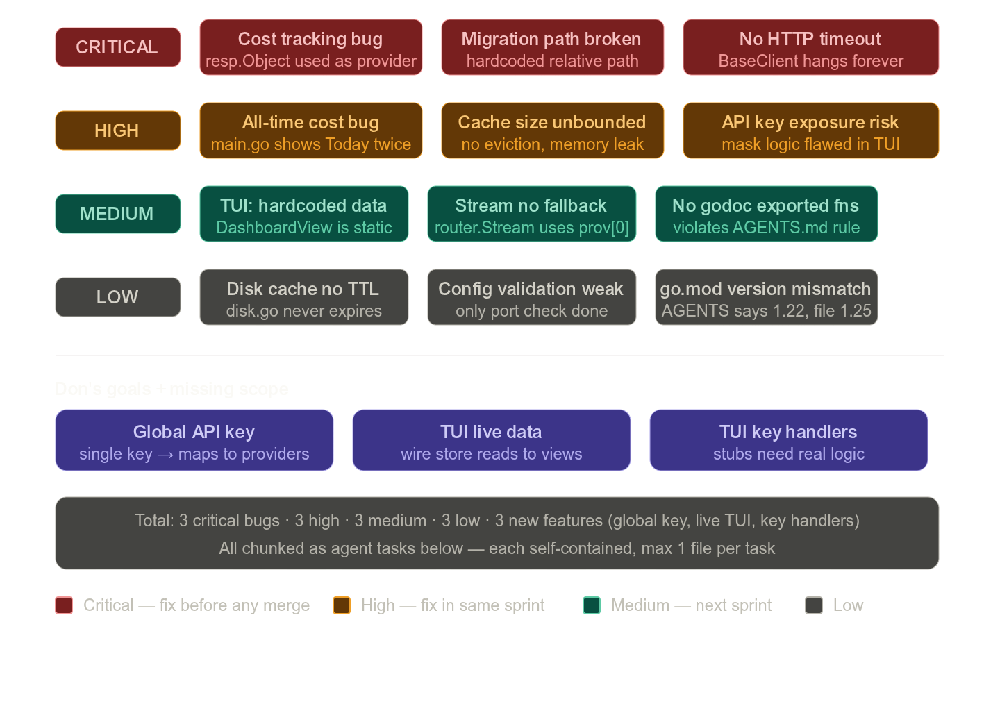

# PROJECT REVIEW REPORT — TENDR

---

## 1. Executive Summary

**Overall score: 6.5/10 — Need Improvements**

Project punya arsitektur yang solid dan dokumentasi yang bagus. Tapi ada 3 bug critical yang bikin data cost dan stability rusak, TUI masih partially fake (hardcoded), dan fitur global API key belum ada. Bukan "critical issues" yang bikin project ga bisa jalan sama sekali — tapi kalau deploy, data yang ditampilkan salah.

---

## 2. Architecture Review

**Kelebihan:**
- Package boundaries clean, dependency direction benar
- Interface-first design (Provider interface) — mudah di-mock
- Pure Go, no CGO — good for cross-platform builds
- AGENTS.md sebagai single source of truth untuk agent workflow

**Kekurangan:**
- `tabs.go` dalam TUI menggunakan hardcoded static data — bukan live dari store
- `router.Stream()` tidak implement fallback, hanya ambil `providers[0]`
- `store.go` baca migration file dari relative path — akan break kalau binary dijalankan dari direktori lain
- `BaseClient` tidak punya HTTP timeout — provider calls bisa hang selamanya

---

## 3. Task List untuk AI Agent

Setiap task di bawah ini **self-contained**: file target, masalah, dan solusi konkret. Agent tidak perlu baca file lain.

---

### ⚠️ TASK-001 — CRITICAL: Fix cost tracking bug di `internal/router/router.go`

**File:** `internal/router/router.go`  
**Fungsi:** `Complete()`, baris tracker.Track

**Masalah:**
```go
// SALAH — resp.Object berisi "chat.completion", bukan nama provider
err := r.tracker.Track(context.Background(), resp.Object, resp.Model, ...)
```
`resp.Object` selalu `"chat.completion"`. Cost tidak pernah dicatat ke provider yang benar.

**Perbaikan:**
```go
// Simpan provider yang digunakan saat Execute()
// Di fallback.go, modifikasi return value untuk include nama provider
// Atau: simpan nama provider di CompletionResponse

// Opsi cepat — tambah field ke CompletionResponse di provider.go:
// Provider string `json:"provider,omitempty"`

// Lalu di setiap adapter (openai, anthropic, gemini, groq), set:
// Provider: p.Name()

// Lalu di router.go:
err := r.tracker.Track(context.Background(), resp.Provider, resp.Model, ...)
```

**Steps:**
1. Buka `internal/provider/provider.go`
2. Tambah field `Provider string` ke struct `CompletionResponse`
3. Di `internal/provider/openai/openai.go` — set `Provider: p.Name()` di return value Complete()
4. Lakukan hal sama di anthropic, gemini, groq adapters
5. Di `internal/router/router.go`, ganti `resp.Object` → `resp.Provider`

---

### ⚠️ TASK-002 — CRITICAL: Fix migration path di `internal/store/store.go`

**File:** `internal/store/store.go`  
**Fungsi:** `runMigrations()`

**Masalah:**
```go
migration, err := os.ReadFile("internal/store/migrations/001_init.sql")
// Path ini relative ke working directory saat binary dijalankan
// Kalau user jalankan dari home dir atau path lain → file not found → panic
```

**Perbaikan — embed migration file:**
```go
// Di store.go, tambah di atas package declaration:
//go:embed migrations/001_init.sql
var migrationSQL string

// Hapus fungsi runMigrations() yang lama, ganti dengan:
func runMigrations(db *sql.DB) error {
    _, err := db.Exec(migrationSQL)
    return err
}
```

**Import yang perlu ditambah:** `_ "embed"` (bukan `embed`, tapi `_` untuk side effect)

**Note untuk agent:** `//go:embed` directive harus berada di file yang sama dengan var yang di-embed, dan path-nya relatif terhadap lokasi file Go tersebut, bukan working directory.

---

### ⚠️ TASK-003 — CRITICAL: Add HTTP timeout ke `internal/provider/client.go`

**File:** `internal/provider/client.go`  
**Struct:** `BaseClient`

**Masalah:**
```go
func NewBaseClient() *BaseClient {
    return &BaseClient{
        HTTPClient: &http.Client{}, // tidak ada timeout — bisa hang selamanya
    }
}
```

**Perbaikan:**
```go
const defaultProviderTimeout = 30 * time.Second

func NewBaseClient() *BaseClient {
    return &BaseClient{
        HTTPClient: &http.Client{
            Timeout: defaultProviderTimeout,
        },
    }
}
```

**Idealnya (future):** Terima timeout sebagai parameter agar bisa dikonfigurasi per provider dari YAML. Untuk sekarang, 30s default sesuai spec di ARCHITECTURE.md.

---

### 🔴 TASK-004 — HIGH: Fix all-time cost display bug di `cmd/tendr/main.go`

**File:** `cmd/tendr/main.go`  
**Fungsi:** `runCost()`

**Masalah:**
```go
fmt.Printf("All Time:  $%.4f\n", summary.Today) // ← BUG: harus summary.AllTime
```

**Perbaikan:**
```go
fmt.Printf("All Time:  $%.4f\n", summary.AllTime)
```

---

### 🔴 TASK-005 — HIGH: Add cache eviction di `internal/cache/exact.go`

**File:** `internal/cache/exact.go`

**Masalah:**  
`Exact` cache pakai `map[string]Entry` tanpa batas. Kalau banyak unique request masuk, memory terus tumbuh — potential OOM di production.

**Perbaikan — tambah max entries dengan simple eviction:**
```go
type Exact struct {
    mu       sync.RWMutex
    items    map[string]Entry
    ttl      time.Duration
    maxItems int           // tambah field ini
}

func NewExact(ttl time.Duration) *Exact {
    return &Exact{
        items:    make(map[string]Entry),
        ttl:      ttl,
        maxItems: 1000, // sesuai default di ARCHITECTURE.md
    }
}

func (c *Exact) Set(key, value string) {
    c.mu.Lock()
    defer c.mu.Unlock()

    // Kalau sudah penuh, hapus expired entries dulu
    if len(c.items) >= c.maxItems {
        c.evictExpired() // panggil tanpa lock (sudah di dalam Lock)
    }

    // Kalau masih penuh setelah evict, hapus random entry
    if len(c.items) >= c.maxItems {
        for k := range c.items {
            delete(c.items, k)
            break
        }
    }

    c.items[key] = Entry{Value: value, CreatedAt: time.Now()}
}

// evictExpired harus dipanggil saat lock sudah dipegang
func (c *Exact) evictExpired() {
    for k, v := range c.items {
        if time.Since(v.CreatedAt) > c.ttl {
            delete(c.items, k)
        }
    }
}
```

---

### 🔴 TASK-006 — HIGH: Fix API key masking di `internal/tui/tabs/tabs.go`

**File:** `internal/tui/tabs/tabs.go`  
**Fungsi:** `ConfigView()`

**Masalah:**
```go
parts := strings.Split(line, ":")
if len(parts) == 2 {
    key := strings.TrimSpace(parts[1])
```
Ini break untuk API key yang mengandung `:` (contoh: beberapa Anthropic keys). `strings.Split(line, ":")` dengan key `sk-ant-xxx:yyy` akan produce 3+ parts, bukan 2.

**Perbaikan:**
```go
if strings.Contains(line, "api_key:") {
    // Ambil semua karakter setelah "api_key:" pertama
    colonIdx := strings.Index(line, "api_key:")
    prefix := line[:colonIdx+8] // "  api_key:"
    rawValue := strings.TrimSpace(line[colonIdx+8:])
    
    // Hapus quote kalau ada
    rawValue = strings.Trim(rawValue, `"'`)
    
    if len(rawValue) > 6 {
        lines[i] = prefix + " " + rawValue[:6] + "••••••••"
    } else if len(rawValue) > 0 {
        lines[i] = prefix + " ••••••••"
    }
    // Kalau kosong (belum diisi), biarkan apa adanya
}
```

---

### 🟡 TASK-007 — MEDIUM: Wire live data ke DashboardView di `internal/tui/tabs/tabs.go`

**File:** `internal/tui/tabs/tabs.go`  
**Fungsi:** `DashboardView()`

**Masalah:**  
Saat ini DashboardView berisi hardcoded string. Provider health, request count, dan last 10 requests semuanya fake.

**Perbaikan — tambah query ke store:**

Pertama, tambah method ke `internal/store/store.go`:
```go
// GetRecentRequests returns last N requests ordered by created_at desc
func (s *Store) GetRecentRequests(ctx context.Context, limit int) ([]RequestRecord, error) {
    rows, err := s.db.QueryContext(ctx,
        `SELECT id, model, provider, prompt_tokens, completion_tokens, total_tokens, cost, pricing_source, created_at
         FROM requests ORDER BY created_at DESC LIMIT ?`, limit)
    if err != nil {
        return nil, err
    }
    defer rows.Close()

    var records []RequestRecord
    for rows.Next() {
        var r RequestRecord
        if err := rows.Scan(&r.ID, &r.Model, &r.Provider, &r.PromptTokens,
            &r.CompletionTokens, &r.TotalTokens, &r.Cost, &r.PricingSource, &r.CreatedAt); err != nil {
            continue
        }
        records = append(records, r)
    }
    return records, rows.Err()
}
```

Lalu update `DashboardView()` untuk membaca dari store dan render data nyata.

---

### 🟡 TASK-008 — MEDIUM: Implement stream fallback di `internal/router/router.go`

**File:** `internal/router/router.go`  
**Fungsi:** `Stream()`

**Masalah:**
```go
providerName := modelCfg.Providers[0] // selalu pakai provider pertama, tidak ada fallback
```

**Perbaikan — tambah loop:**
```go
func (r *Router) Stream(ctx context.Context, modelAlias string, req *provider.CompletionRequest) (<-chan *provider.StreamResponse, <-chan error) {
    modelCfg, ok := r.models[modelAlias]
    if !ok {
        errChan := make(chan error, 1)
        errChan <- fmt.Errorf("router: model alias not found: %s", modelAlias)
        respChan := make(chan *provider.StreamResponse)
        close(respChan)
        return respChan, errChan
    }

    // Try providers in order (same as Complete)
    for _, name := range modelCfg.Providers {
        p, ok := r.providers[name]
        if !ok {
            continue
        }
        // Stream from first available provider
        // True streaming fallback mid-stream is complex; use first healthy provider
        return p.Stream(ctx, req)
    }

    errChan := make(chan error, 1)
    errChan <- fmt.Errorf("router: no providers available for alias: %s", modelAlias)
    respChan := make(chan *provider.StreamResponse)
    close(respChan)
    return respChan, errChan
}
```

---

### 🟡 TASK-009 — MEDIUM: Add godoc ke semua exported functions

**Files:** Semua file di `internal/` yang punya exported function tanpa komentar godoc.

**Rule dari AGENTS.md:** `ALL exported functions MUST have godoc comments`

**Contoh format yang benar:**
```go
// NewExact creates a new in-memory exact cache with the given TTL duration.
// Entries older than ttl will not be returned on Get.
func NewExact(ttl time.Duration) *Exact {

// NewLimiter creates a token bucket rate limiter.
// rate is tokens added per second, burst is the maximum token bucket size.
func NewLimiter(rate, burst float64) *Limiter {
```

**Files yang butuh godoc (prioritas):**
- `internal/cache/exact.go` — `NewExact`, `HashKey`, `Get`, `Set`
- `internal/ratelimit/limiter.go` — `NewLimiter`, `Allow`
- `internal/cost/tracker.go` — `NewTracker`, `Track`
- `internal/store/store.go` — `New`, semua public methods
- `internal/provider/client.go` — `NewBaseClient`, `DoRequest`, `StreamSSE`, `MapHTTPError`

---

### 🟢 TASK-010 — LOW: Fix disk cache — tambah TTL support di `internal/cache/disk.go`

**File:** `internal/cache/disk.go`

**Masalah:**  
`Disk` cache tidak pernah expire entries. Tumbuh selamanya.

**Perbaikan — wrap value dengan timestamp:**
```go
type diskEntry struct {
    Value     string    `json:"v"`
    CreatedAt time.Time `json:"t"`
}

type Disk struct {
    db  *bbolt.DB
    ttl time.Duration // tambah field
}

func NewDisk(path string, ttl time.Duration) (*Disk, error) {
    // ... existing bbolt open code ...
    return &Disk{db: db, ttl: ttl}, err
}

func (d *Disk) Get(key string) (string, bool) {
    var val []byte
    d.db.View(func(tx *bbolt.Tx) error {
        b := tx.Bucket([]byte("cache"))
        if b == nil { return nil }
        val = b.Get([]byte(key))
        return nil
    })
    if len(val) == 0 { return "", false }

    var entry diskEntry
    if err := json.Unmarshal(val, &entry); err != nil { return "", false }
    
    if d.ttl > 0 && time.Since(entry.CreatedAt) > d.ttl {
        d.db.Update(func(tx *bbolt.Tx) error {
            b := tx.Bucket([]byte("cache"))
            if b != nil { b.Delete([]byte(key)) }
            return nil
        })
        return "", false
    }
    return entry.Value, true
}
```

---

### 🟢 TASK-011 — LOW: Add validation ke `internal/config/config.go`

**File:** `internal/config/config.go`  
**Fungsi:** `validate()`

**Masalah:**  
Validasi sekarang hanya cek port. API key kosong, model alias kosong, fallback mode invalid — semua lolos.

**Perbaikan:**
```go
func validate(cfg *Config) error {
    if cfg.Server.Port <= 0 || cfg.Server.Port > 65535 {
        return fmt.Errorf("validate: invalid server port: %d", cfg.Server.Port)
    }
    
    validFallbackModes := map[string]bool{"reliable": true, "fast": true, "smart": true}
    for _, m := range cfg.Models {
        if m.Alias == "" {
            return fmt.Errorf("validate: model alias cannot be empty")
        }
        if len(m.Providers) == 0 {
            return fmt.Errorf("validate: model %q has no providers", m.Alias)
        }
        if m.FallbackMode != "" && !validFallbackModes[m.FallbackMode] {
            return fmt.Errorf("validate: model %q has invalid fallback_mode: %q (must be reliable|fast|smart)", m.Alias, m.FallbackMode)
        }
    }
    return nil
}
```

---

### 🟢 TASK-012 — LOW: Fix go.mod version inconsistency

**File:** `go.mod`

**Masalah:**  
`go.mod` declare `go 1.25.3` tapi AGENTS.md dan ARCHITECTURE.md bilang `Go 1.22+`. Go 1.25.3 belum ada (latest stable adalah 1.22.x/1.23.x saat ini). Ini likely typo.

**Perbaikan:**
```
go 1.22.0
```

Atau update semua docs untuk konsisten dengan versi yang dipakai.

---

## 4. Fitur Baru — Global API Key (Permintaan Don)

Ini design pattern yang gue rekomendasikan sebelum implementasi:

### 🆕 TASK-013 — FEATURE: Global API key system (OpenRouter-style)

**Konsep:** Satu key (`TENDR-xxx`) → di-resolve ke provider keys yang dikonfigurasi secara internal.

**Files yang perlu dibuat/dimodifikasi:**
- `internal/config/config.go` — tambah `GlobalKey` field
- `internal/gateway/middleware.go` (buat kalau belum ada) — extract dan validate global key dari header

**Design:**

```yaml
# config.yaml
global_key: "tndr-your-secret-key-here"  # opsional, kalau kosong = no auth

providers:
  openai:
    api_key: "sk-..."
```

```go
// internal/config/config.go — tambah ke ServerConfig
type ServerConfig struct {
    Port      int    `mapstructure:"port"`
    LogLevel  string `mapstructure:"log_level"`
    GlobalKey string `mapstructure:"global_key"` // tambah ini
}
```

```go
// internal/gateway/middleware.go — buat file baru
package gateway

import (
    "net/http"
    "github.com/RizkiRdm/TNDR/internal/config"
)

// GlobalKeyMiddleware validates the X-API-Key or Authorization Bearer header
// against the configured global_key. If global_key is empty, skips auth.
func GlobalKeyMiddleware(cfg *config.ServerConfig) func(http.Handler) http.Handler {
    return func(next http.Handler) http.Handler {
        return http.HandlerFunc(func(w http.ResponseWriter, r *http.Request) {
            if cfg.GlobalKey == "" {
                next.ServeHTTP(w, r)
                return
            }

            // Support both OpenAI-style Bearer and direct key
            key := r.Header.Get("Authorization")
            if len(key) > 7 && key[:7] == "Bearer " {
                key = key[7:]
            }
            if key == "" {
                key = r.Header.Get("X-API-Key")
            }

            if key != cfg.GlobalKey {
                w.Header().Set("Content-Type", "application/json")
                w.WriteHeader(http.StatusUnauthorized)
                w.Write([]byte(`{"error":{"code":"invalid_key","message":"Invalid API key"}}`))
                return
            }
            next.ServeHTTP(w, r)
        })
    }
}
```

```go
// internal/gateway/gateway.go — register middleware di setupRoutes()
mux.Use(GlobalKeyMiddleware(&cfg.Server)) // tambahkan ini
```

**Security notes untuk agent:**
- NEVER log the key value, even partially
- Key comparison harus constant-time untuk avoid timing attacks: `subtle.ConstantTimeCompare([]byte(key), []byte(cfg.GlobalKey)) == 1`
- Import `crypto/subtle` untuk itu

---

## 5. Security Findings

| Severity | Vulnerability | Risk | Recommendation |
|---|---|---|---|
| HIGH | API key masking bug (TASK-006) | Partial key exposure di TUI | Fix split logic |
| MEDIUM | No constant-time key comparison (TASK-013) | Timing attack jika global key diimplementasi | Use `crypto/subtle.ConstantTimeCompare` |
| MEDIUM | Pricing URL tidak divalidasi | SSRF jika URL bisa dikonfigurasi user | Allowlist URL atau hardcode saja |
| LOW | Config file permissions 0644 | Readable oleh semua user di shared system | Buat 0600 saat `tendr init` |
| LOW | `runInit` buat `config.yaml` dengan 0644 | Same issue | `os.WriteFile("config.yaml", data, 0600)` |

---

## 6. Performance Findings

| Area | Issue | Impact | Fix |
|---|---|---|---|
| BaseClient | No HTTP timeout | Provider hang → gateway hang forever | TASK-003 |
| Exact cache | No size limit | Memory leak | TASK-005 |
| Cost tracking goroutine | `context.Background()` in goroutine | Request cancellation tidak dipropagasi | Pass parent ctx dengan timeout terpisah |
| Disk cache | No TTL | Unbounded disk growth | TASK-010 |

---

## 7. QA / Testing Gaps

- Tidak ada test untuk `internal/cost/tracker.go` — core business logic tanpa coverage
- Tidak ada test untuk `internal/config/validate()` — edge cases tidak tertangkap
- Tidak ada test untuk `internal/store` queries
- `gateway_test.go` punya test rate limit tapi tidak test happy path atau fallback response
- Tidak ada integration test end-to-end (gateway → router → provider mock → store)

---

## 8. Production Readiness Checklist

- [x] Environment configuration (YAML)
- [ ] Error logging — ada, tapi tidak semua event dicatat sesuai ARCHITECTURE.md spec
- [ ] Monitoring — tidak ada (planned V2)
- [x] Backup strategy — N/A, SQLite local
- [ ] Security hardening — global key middleware belum ada
- [ ] CI/CD — belum ada GitHub Actions
- [ ] Automated testing — partial (3 test files, tidak cover critical paths)
- [x] Documentation — excellent (AGENTS.md, ARCHITECTURE.md, PLAN.md)
- [ ] Performance optimization — cache eviction belum ada

---

## 9. Priority Execution Order

**Sprint ini (block merge):**
1. TASK-001 — Cost tracking bug
2. TASK-002 — Migration path
3. TASK-003 — HTTP timeout
4. TASK-004 — All-time display bug

**Sprint ini (sama, tapi tidak block):**
5. TASK-005 — Cache eviction
6. TASK-006 — API key masking

**Sprint berikut:**
7. TASK-013 — Global API key feature
8. TASK-007 — TUI live data
9. TASK-008 — Stream fallback
10. TASK-009 — Godoc

**Kapan ada waktu:**
11. TASK-010 — Disk cache TTL
12. TASK-011 — Config validation
13. TASK-012 — go.mod version

---

## 10. Final Verdict

**Layak deploy?** Belum — TASK-001 sampai TASK-004 harus fix dulu. Cost tracking yang broken berarti data di TUI Cost tab semuanya salah.

**Risiko utama:** Cost data corruption (TASK-001), binary crash di non-standard working directory (TASK-002), gateway hang (TASK-003).

**Technical debt score:** 4/10 — rendah. Codebase masih muda, pattern sudah benar, debt-nya lebih ke incomplete implementation bukan accumulated shortcuts.

**Maintainability:** 8/10 — AGENTS.md dan ARCHITECTURE.md bagus banget untuk onboarding agent baru. Package structure clean.

**Scalability:** 7/10 — single-binary design tepat untuk scope. Cache eviction perlu fix untuk production load.